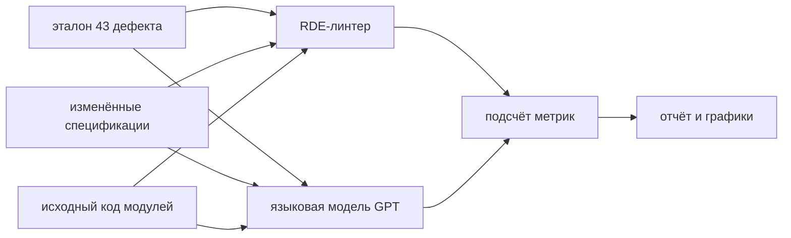

# Бенчмарк: RDE-линтер и языковая модель (Open vAIR)

**Дата отчёта:** 2026-05-17 14:04 UTC  
**Эталонных дефектов (внесено намеренно):** 43  
**Модулей Open vAIR:** 9  

## Протокол

## 1. Сводные метрики

Пояснение к столбцам: **верно найдено** — дефект из эталона обнаружен; **пропущено** — дефект из эталона не найден; **ложные** — лишние замечания; **точность** — доля верных среди всех срабатываний; **полнота** — доля найденных среди всех дефектов эталона.

| Инструмент | Верно | Пропущ. | Ложные | Точность | Полнота | F1 | Время, с |
| --- | --- | --- | --- | --- | --- | --- | --- |
| RDE-линтер | 43 | 0 | 0 | 100.0% | 100.0% | 1.000 | 0.2287 |
| Языковая модель (gpt-5.5) | 43 | 0 | 9 | 82.7% | 100.0% | 0.905 | 52.8821 |

**Стоимость запросов к API:** $1.1891  
**Всего замечаний модели:** 52  

**Скорость линтера:** около 188 эталонных дефектов в секунду.  

## 2. Полнота по типу внесённого дефекта

| Тип дефекта | Штук | Линтер | Полнота L | Модель | Полнота M |
| --- | --- | --- | --- | --- | --- |
| фантомный класс в спецификации | 38 | 38/38 | 100.0% | 38/38 | 100.0% |
| неверное имя метода в спецификации | 5 | 5/5 | 100.0% | 5/5 | 100.0% |

## 3. Полнота по модулю

| Модуль | Дефектов в эталоне | Полнота линтера | Полнота модели |
| --- | --- | --- | --- |
| backup | 5 | 100.0% | 100.0% |
| event_store | 5 | 100.0% | 100.0% |
| image | 5 | 100.0% | 100.0% |
| network | 5 | 100.0% | 100.0% |
| storage | 5 | 100.0% | 100.0% |
| template | 5 | 100.0% | 100.0% |
| user | 5 | 100.0% | 100.0% |
| virtual_machines | 5 | 100.0% | 100.0% |
| volume | 3 | 100.0% | 100.0% |

## 4. Скорость обработки

| Модуль | Линтер, с | Модель, с |
| --- | --- | --- |
| backup | 0.014 | 3.4 |
| event_store | 0.008 | 4.7 |
| image | 0.024 | 11.4 |
| network | 0.030 | 5.4 |
| storage | 0.035 | 3.5 |
| template | 0.021 | 7.1 |
| user | 0.013 | 5.6 |
| virtual_machines | 0.051 | 8.9 |
| volume | 0.031 | 2.8 |

## 5. Токены и стоимость запросов к модели

| Модуль | Токенов на вход | Токенов на выход | USD | Замечаний |
| --- | --- | --- | --- | --- |
| backup | 14863 | 284 | 0.0828 | 5 |
| event_store | 6504 | 299 | 0.0415 | 5 |
| image | 23989 | 829 | 0.1448 | 9 |
| network | 32088 | 299 | 0.1694 | 5 |
| storage | 34024 | 289 | 0.1788 | 5 |
| template | 16802 | 376 | 0.0953 | 6 |
| user | 9750 | 511 | 0.0641 | 9 |
| virtual_machines | 50113 | 552 | 0.2671 | 5 |
| volume | 27977 | 179 | 0.1453 | 3 |

## 6. Распределение дефектов по типам

## 7. Ложные срабатывания языковой модели

**Как считаем в этом эксперименте.** Замечание модели — **ложное срабатывание**, если оно **не совпало** ни с одной из 43 записей в эталоне (`ground_truth.json`), даже если по смыслу контракт и код действительно расходятся.

Всего замечаний модели: **52**. **Верно по эталону:** 43. **Лишние:** 9. **Точность** (доля верных среди всех замечаний): 43 / (43 + 9) = 82.7%.

### Почему линтер таких ложных срабатываний не дал

RDE-линтер сравнивает изменённую спецификацию с кодом по жёстким правилам (разбор дерева синтаксиса) и в метриках учитывает только **те 43 дефекта, которые мы сами внесли**. Он не «штрафует» старые расхождения, уже жившие в спецификации до эксперимента — например, когда в контракте параметр описан как query, а в FastAPI он в path.

Языковая модель получила **весь** архитектурный контракт (блок `rde`) и **весь** исходный код модуля и сообщила о **любом** заметном несоответствии. Часть таких замечаний может быть полезной на практике, но для **этого** сравнения с эталоном они считаются лишними.

### Сводная таблица ложных срабатываний

| № | Модуль | Сущность | Категория | Почему ложное |
| --- | --- | --- | --- | --- |
| 1 | template | VolumeAttachment | класс объявлен не так, как в коде | В контракте класс указан на одном уровне, в коде — вложенным в другой класс. Среди 43 эталонных дефектов для «template» такой записи не было (были только: фантомный класс в спецификации). |
| 2 | image | GET /images/{image_id}/ get_image | тип параметра HTTP не совпадает | В изменённой спецификации модуля «image» мы намеренно вносили только: фантомный класс в спецификации. Замечание про то, что в контракте параметр указан как query, а в коде он берётся из пути URL (path), **экспериментом не добавлялось** — так было уже в исходной спецификации. Линтер в этом прогоне проверял только внесённые нами 43 дефекта; языковая модель просмотрела весь контракт целиком. |
| 3 | image | DELETE /images/{image_id}/ delete_image | тип параметра HTTP не совпадает | В изменённой спецификации модуля «image» мы намеренно вносили только: фантомный класс в спецификации. Замечание про то, что в контракте параметр указан как query, а в коде он берётся из пути URL (path), **экспериментом не добавлялось** — так было уже в исходной спецификации. Линтер в этом прогоне проверял только внесённые нами 43 дефекта; языковая модель просмотрела весь контракт целиком. |
| 4 | image | POST /images/{image_id}/attach/ attach_image | тип параметра HTTP не совпадает | В изменённой спецификации модуля «image» мы намеренно вносили только: фантомный класс в спецификации. Замечание про то, что в контракте параметр указан как query, а в коде он берётся из пути URL (path), **экспериментом не добавлялось** — так было уже в исходной спецификации. Линтер в этом прогоне проверял только внесённые нами 43 дефекта; языковая модель просмотрела весь контракт целиком. |
| 5 | image | DELETE /images/{image_id}/detach/ detach_image | тип параметра HTTP не совпадает | В изменённой спецификации модуля «image» мы намеренно вносили только: фантомный класс в спецификации. Замечание про то, что в контракте параметр указан как query, а в коде он берётся из пути URL (path), **экспериментом не добавлялось** — так было уже в исходной спецификации. Линтер в этом прогоне проверял только внесённые нами 43 дефекта; языковая модель просмотрела весь контракт целиком. |
| 6 | user | DELETE /user/{user_id}/ delete_user parameter user_id | тип параметра HTTP не совпадает | В изменённой спецификации модуля «user» мы намеренно вносили только: фантомный класс в спецификации. Замечание про то, что в контракте параметр указан как query, а в коде он берётся из пути URL (path), **экспериментом не добавлялось** — так было уже в исходной спецификации. Линтер в этом прогоне проверял только внесённые нами 43 дефекта; языковая модель просмотрела весь контракт целиком. |
| 7 | user | POST /user/{user_id}/change-password/ change_password parameter user_id | тип параметра HTTP не совпадает | В изменённой спецификации модуля «user» мы намеренно вносили только: фантомный класс в спецификации. Замечание про то, что в контракте параметр указан как query, а в коде он берётся из пути URL (path), **экспериментом не добавлялось** — так было уже в исходной спецификации. Линтер в этом прогоне проверял только внесённые нами 43 дефекта; языковая модель просмотрела весь контракт целиком. |
| 8 | user | POST /user/{user_id}/change-password/ change_password parameter user_data | лишний или неверный параметр API | Расхождение в описании параметров HTTP-обработчика (зависимости FastAPI, тело запроса, параметры маршрута). В список из 43 внесённых дефектов для «user» это не входило (там только: фантомный класс в спецификации). |
| 9 | user | POST /user/{user_id}/create/ create_user parameter user_id | тип параметра HTTP не совпадает | В изменённой спецификации модуля «user» мы намеренно вносили только: фантомный класс в спецификации. Замечание про то, что в контракте параметр указан как query, а в коде он берётся из пути URL (path), **экспериментом не добавлялось** — так было уже в исходной спецификации. Линтер в этом прогоне проверял только внесённые нами 43 дефекта; языковая модель просмотрела весь контракт целиком. |

### Подробный разбор каждого ложного срабатывания

#### Ложное срабатывание 1: модуль «template» — VolumeAttachment

- **Категория:** класс объявлен не так, как в коде
- **Тип в ответе модели:** «отсутствует в коде» (`missing_in_code`)
- **Почему считаем ложным:** В контракте класс указан на одном уровне, в коде — вложенным в другой класс. Среди 43 эталонных дефектов для «template» такой записи не было (были только: фантомный класс в спецификации).
- **Текст модели (как вернула API):** Class VolumeAttachment is declared as a required adapters class, but in code it is only defined as a nested class inside VolumeModelDTO, not as a top-level class.

#### Ложное срабатывание 2: модуль «image» — GET /images/{image_id}/ get_image

- **Категория:** тип параметра HTTP не совпадает
- **Тип в ответе модели:** «отсутствует в коде» (`missing_in_code`)
- **Почему считаем ложным:** В изменённой спецификации модуля «image» мы намеренно вносили только: фантомный класс в спецификации. Замечание про то, что в контракте параметр указан как query, а в коде он берётся из пути URL (path), **экспериментом не добавлялось** — так было уже в исходной спецификации. Линтер в этом прогоне проверял только внесённые нами 43 дефекта; языковая модель просмотрела весь контракт целиком.
- **Текст модели (как вернула API):** Endpoint is declared with parameter image_id as a required query parameter, but in code image_id is a path parameter.

#### Ложное срабатывание 3: модуль «image» — DELETE /images/{image_id}/ delete_image

- **Категория:** тип параметра HTTP не совпадает
- **Тип в ответе модели:** «отсутствует в коде» (`missing_in_code`)
- **Почему считаем ложным:** В изменённой спецификации модуля «image» мы намеренно вносили только: фантомный класс в спецификации. Замечание про то, что в контракте параметр указан как query, а в коде он берётся из пути URL (path), **экспериментом не добавлялось** — так было уже в исходной спецификации. Линтер в этом прогоне проверял только внесённые нами 43 дефекта; языковая модель просмотрела весь контракт целиком.
- **Текст модели (как вернула API):** Endpoint is declared with parameter image_id as a required query parameter, but in code image_id is a path parameter.

#### Ложное срабатывание 4: модуль «image» — POST /images/{image_id}/attach/ attach_image

- **Категория:** тип параметра HTTP не совпадает
- **Тип в ответе модели:** «отсутствует в коде» (`missing_in_code`)
- **Почему считаем ложным:** В изменённой спецификации модуля «image» мы намеренно вносили только: фантомный класс в спецификации. Замечание про то, что в контракте параметр указан как query, а в коде он берётся из пути URL (path), **экспериментом не добавлялось** — так было уже в исходной спецификации. Линтер в этом прогоне проверял только внесённые нами 43 дефекта; языковая модель просмотрела весь контракт целиком.
- **Текст модели (как вернула API):** Endpoint is declared with parameter image_id as a required query parameter, but in code image_id is a path parameter.

#### Ложное срабатывание 5: модуль «image» — DELETE /images/{image_id}/detach/ detach_image

- **Категория:** тип параметра HTTP не совпадает
- **Тип в ответе модели:** «отсутствует в коде» (`missing_in_code`)
- **Почему считаем ложным:** В изменённой спецификации модуля «image» мы намеренно вносили только: фантомный класс в спецификации. Замечание про то, что в контракте параметр указан как query, а в коде он берётся из пути URL (path), **экспериментом не добавлялось** — так было уже в исходной спецификации. Линтер в этом прогоне проверял только внесённые нами 43 дефекта; языковая модель просмотрела весь контракт целиком.
- **Текст модели (как вернула API):** Endpoint is declared with parameter image_id as a required query parameter, but in code image_id is a path parameter.

#### Ложное срабатывание 6: модуль «user» — DELETE /user/{user_id}/ delete_user parameter user_id

- **Категория:** тип параметра HTTP не совпадает
- **Тип в ответе модели:** «отсутствует в коде» (`missing_in_code`)
- **Почему считаем ложным:** В изменённой спецификации модуля «user» мы намеренно вносили только: фантомный класс в спецификации. Замечание про то, что в контракте параметр указан как query, а в коде он берётся из пути URL (path), **экспериментом не добавлялось** — так было уже в исходной спецификации. Линтер в этом прогоне проверял только внесённые нами 43 дефекта; языковая модель просмотрела весь контракт целиком.
- **Текст модели (как вернула API):** Endpoint delete_user has user_id as a path parameter in code, but the spec declares it as a query parameter.

#### Ложное срабатывание 7: модуль «user» — POST /user/{user_id}/change-password/ change_password parameter user_id

- **Категория:** тип параметра HTTP не совпадает
- **Тип в ответе модели:** «отсутствует в коде» (`missing_in_code`)
- **Почему считаем ложным:** В изменённой спецификации модуля «user» мы намеренно вносили только: фантомный класс в спецификации. Замечание про то, что в контракте параметр указан как query, а в коде он берётся из пути URL (path), **экспериментом не добавлялось** — так было уже в исходной спецификации. Линтер в этом прогоне проверял только внесённые нами 43 дефекта; языковая модель просмотрела весь контракт целиком.
- **Текст модели (как вернула API):** Endpoint change_password has user_id as a path parameter in code, but the spec declares it as a query parameter.

#### Ложное срабатывание 8: модуль «user» — POST /user/{user_id}/change-password/ change_password parameter user_data

- **Категория:** лишний или неверный параметр API
- **Тип в ответе модели:** «отсутствует в коде» (`missing_in_code`)
- **Почему считаем ложным:** Расхождение в описании параметров HTTP-обработчика (зависимости FastAPI, тело запроса, параметры маршрута). В список из 43 внесённых дефектов для «user» это не входило (там только: фантомный класс в спецификации).
- **Текст модели (как вернула API):** Spec declares required dependency parameter user_data: Dict for change_password endpoint, but the handler has no such parameter; get_current_user is only listed as a route-level dependency.

#### Ложное срабатывание 9: модуль «user» — POST /user/{user_id}/create/ create_user parameter user_id

- **Категория:** тип параметра HTTP не совпадает
- **Тип в ответе модели:** «отсутствует в коде» (`missing_in_code`)
- **Почему считаем ложным:** В изменённой спецификации модуля «user» мы намеренно вносили только: фантомный класс в спецификации. Замечание про то, что в контракте параметр указан как query, а в коде он берётся из пути URL (path), **экспериментом не добавлялось** — так было уже в исходной спецификации. Линтер в этом прогоне проверял только внесённые нами 43 дефекта; языковая модель просмотрела весь контракт целиком.
- **Текст модели (как вернула API):** Endpoint create_user has user_id as a path parameter in code, but the spec declares it as a query parameter.

### Сколько ложных срабатываний по модулям

| Модуль | Ложных | Эталонных дефектов | Что вносили в эталон |
| --- | --- | --- | --- |
| image | 4 | 5 | фантомный класс в спецификации |
| template | 1 | 5 | фантомный класс в спецификации |
| user | 4 | 5 | фантомный класс в спецификации |

## 8. Пропущенные дефекты (не найдены)

### Линтер — пропущено: 0
Ни одного эталонного дефекта не пропущено.

### Языковая модель — пропущено: 0
Ни одного эталонного дефекта не пропущено.

## 9. Файлы результатов

| Файл | Содержание |
|------|------------|
| `ground_truth.json` | Список 43 внесённых дефектов (эталон) |
| `linter_results.json` | Полный вывод линтера |
| `llm_results.json` | Полный ответ языковой модели |
| `evaluation_report.json` | Метрики и разбор по каждому дефекту |
| `benchmark_analysis.json` | Сводные числа для графиков |
