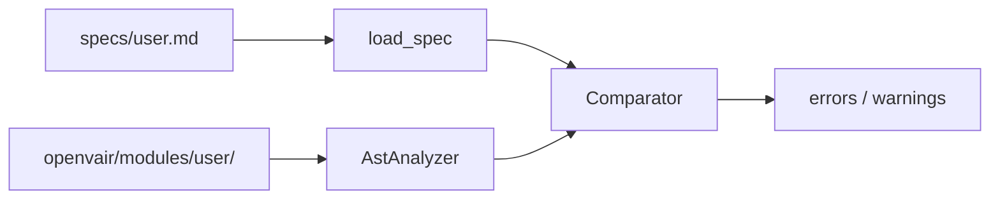

# RDE architectural contract linter — complete guide

Full documentation for the `requirements_linter` package in the Open vAIR repository. 

Russian version: [LINTER_GUIDE_RU.md](LINTER_GUIDE_RU.md).

---

## Table of contents

1. [Why this tool exists](#1-why-this-tool-exists)
2. [What the linter does and does not do](#2-what-the-linter-does-and-does-not-do)
3. [How a lint run works (step by step)](#3-how-a-lint-run-works-step-by-step)
4. [Contract files in specs/](#4-contract-files-in-specs)
5. [Open vAIR module layers](#5-open-vair-module-layers)
6. [Three kinds of contract entries](#6-three-kinds-of-contract-entries)
7. [Errors and warnings](#7-errors-and-warnings)
8. [Reserved keys inside the linter data structures](#8-reserved-keys-inside-the-linter-data-structures)
9. [FastAPI HTTP routes](#9-fastapi-http-routes)
10. [Running from the command line](#10-running-from-the-command-line)
11. [Pre-commit integration](#11-pre-commit-integration)
12. [Package layout](#12-package-layout)
13. [Messages: meaning and how to fix](#13-messages-meaning-and-how-to-fix)
14. [HTTP parsing limitations](#14-http-parsing-limitations)
15. [Workflow for new and existing modules](#15-workflow-for-new-and-existing-modules)
16. [FAQ](#16-faq)
17. [Command reference](#17-command-reference)

---

## 1. Why this tool exists

Open vAIR modules under `openvair/modules/<name>/` follow **Domain-Driven Design (DDD)**: code is split into layers — `domain`, `service_layer`, `adapters`, `entrypoints`. In parallel, each module has an **architectural contract**: a formal list of classes, module-level functions, and HTTP endpoints that count as the **agreed public surface** of that module.

Without automation, the contract and the code **drift apart**:

- the spec still lists `update_job` but the code renamed it to `edit_job`;
- a new REST endpoint was added but `specs/<module>.md` was not updated;
- the contract says a class lives in `domain` but the file sits elsewhere.

The RDE linter (**Requirements-Driven Engineering**) addresses this: it **reads the contract**, **reads Python sources**, and **compares** them. The output is a concrete list of mismatches suitable for CI and for local checks before push.

The linter **does not replace** unit tests and **does not judge** business logic. It answers: “Does the codebase **contain** what we **promised** in the architectural contract, in the expected shape?”

---

## 2. What the linter does and does not do

### 2.1. What it does


| Step                            | Explanation                                        |
| ------------------------------- | -------------------------------------------------- |
| Read `specs/<name>.md`          | Extract the ````rde` fenced YAML block             |
| Walk `openvair/modules/<name>/` | All `*.py` files except `tests/` and `__pycache__` |
| Parse with AST                  | Build syntax trees; **code is not executed**       |
| Compare contract vs code        | Classes, methods, module functions, FastAPI routes |


Only **public** names are considered: identifiers that do **not** start with `_`.

---

## 3. How a lint run works (step by step)

Logical flow for one pair: **contract file + module directory**.




**Step 1 — Load contract** (`contract/spec_document.py`)

- Open `specs/<name>.md`.
- Cut out the first ````rde` … ````` block.
- Parse YAML and normalize to a fixed shape: `feature`, `layers`, `required_classes`, `required_module_functions`, `required_http_endpoints`.

**Step 2 — Read module code** (`core/ast_specs.py`, `core/analyzer.py`)

- Read every `*.py` under `openvair/modules/<name>/`.
- Use the **first path segment** to assign a layer (`entrypoints/api.py` → `entrypoints`).
- Build a **per-layer index**:
  - each class name → list of public methods;
  - under key `$module_functions$` → each file path → top-level function names;
  - in `entrypoints`, under `$http_endpoints$` → list of HTTP route descriptions.

**Step 3 — Compare** (`core/comparator.py`)

- For each layer in the contract, verify everything **required by YAML** is **found in code**.
- If warnings are enabled, also report what exists **in code** but is **not listed** in the contract.

**Step 4 — Result**

- **Errors** — contract requires something missing in code → exit code `1`.
- **Warnings** — extra public symbols in code → exit code `0` if there are no errors.ы

---

## 4. Contract files in specs/

### 4.1. Location and naming

- Directory: `specs/` at repo root.
- File name: usually matches the module, e.g. `user.md`, `scheduler.md`.
- YAML field `feature:` must match the module folder: `openvair/modules/user/`.

### 4.2. Two parts of the file

**Human part** — titles, prose, diagrams (as in `specs/scheduler.md`). The linter **ignores** this.

**Machine part** — fenced block:

```markdown
# Open vAIR contract: my_feature

Free-form description.

```rde
meta:
  source: openvair/modules/my_feature
feature: my_feature
layers:
  domain:
    required_classes: []
```

```

The `rde` tag on the fence is **required**. Without it, `load_spec` fails.

### 4.3. Legacy format

Standalone `specs/<name>.yaml` / `.yml` still work. New modules should use `.md` + `rde` block.

### 4.4. Shorthand YAML

On load, shorthand is expanded:


| Shorthand                                  | Becomes                      |
| ------------------------------------------ | ---------------------------- |
| `classes:`                                 | `required_classes:`          |
| `module_functions:`                        | `required_module_functions:` |
| `http:` with `router_prefix` / `endpoints` | `required_http_endpoints:`   |


---

## 5. Open vAIR module layers

The linter only recognizes these first path segments inside a module:


| Layer           | Folder           | Typical content                |
| --------------- | ---------------- | ------------------------------ |
| `domain`        | `domain/`        | Entities, domain services      |
| `service_layer` | `service_layer/` | Use cases, Unit of Work        |
| `adapters`      | `adapters/`      | Repositories, ORM              |
| `entrypoints`   | `entrypoints/`   | FastAPI, CRUD, request schemas |


Files outside these trees (e.g. `helpers/foo.py` at module root) are **not** assigned to a layer.

In `layers:` you list only layers you want checked. An empty layer (`required_classes: []`) is valid.

---

## 6. Three kinds of contract entries

### 6.1. Classes and methods (`required_classes`)

Contract:

```yaml
domain:
  required_classes:
    - name: CronJobScheduler
      methods:
        - create_job
        - delete_job
```

The linter scans `domain/` for class **exactly** named `CronJobScheduler` and checks public methods `create_job` and `delete_job`.

Notes:

- `SchedulerCRUD` ≠ `SchedulerCrud`.
- Private `_helper` is neither required nor reported as missing from the contract.

### 6.2. Module-level functions (`required_module_functions`)

For `def` / `async def` at **file top level**:

```yaml
entrypoints:
  required_module_functions:
    - relative_path: entrypoints/api.py
      functions:
        - get_jobs
```

- `relative_path` is from `openvair/modules/<feature>/`, not repo root.
- The file must exist under a known layer path.

### 6.3. HTTP routes (`required_http_endpoints`)

Entrypoints layer only:

```yaml
entrypoints:
  required_http_endpoints:
    - method: GET
      path: /scheduler/jobs
      handler: get_jobs
      parameters:
        - name: crud
          kind: depends
          required: true
          type_hint: SchedulerCRUD
```

Match is on **method + full path + handler function name**. Parameters are compared as `(name, kind, required, type_hint)` tuples.

---

## 7. Errors and warnings

### 7.1. Errors (block CI / fail commit hooks)

**Direction: contract → code.**

Example: contract lists `update_job`, code only has `edit_job` → error “does not contain expected method update_job”.

Any error → exit code `1`.

### 7.2. Warnings (non-blocking by default)

**Direction: code → contract.**

Example: code has public method `helper` not listed under the class in the contract → warning printed; CI may still pass.

Suppress:

```bash
python requirements_linter/rde_linter.py specs/user.md openvair/modules/user --no-warn-extras
python requirements_linter/lint_repo_specs.py --no-warn-extras
```

Fix **errors** first; then decide whether warnings mean the contract should grow.

---

## 8. Reserved keys inside the linter data structures

Each layer is stored as one dictionary:

- normal keys — **class names** → method lists;
- `**$module_functions$`** — nested dict: file path → function names;
- `**$http_endpoints$`** — list of routes (entrypoints only).

These are **internal key strings**, not valid class names. A Python class literally named `$module_functions$` will make parsing fail. The same strings must not appear as `name` in `required_classes` in YAML.

---

## 9. FastAPI HTTP routes

### 9.1. How paths are built

1. Find `router = APIRouter(prefix="/scheduler")` with a **string literal** prefix.
2. Find `@router.get("/jobs")` etc. with a **string literal** path.
3. Join prefix and path into the full path stored in the contract comparison.

### 9.2. Parameter `kind`


| In handler code                                                | Contract `kind`                     |
| -------------------------------------------------------------- | ----------------------------------- |
| `Depends(...)`                                                 | `depends`                           |
| `Path(...)`                                                    | `path`                              |
| `Query(...)`                                                   | `query`                             |
| `Body` / `Form` / `File`                                       | `body`                              |
| No FastAPI default, annotation like `schemas.CreateJobRequest` | often `body` (fixed AST shape rule) |
| Otherwise                                                      | usually `query`                     |


Mismatch → `parameter contract mismatch` with `spec:` and `code:` lists in the message.

**Reliable approach:** set `kind` and `type_hint` in the contract to match one linter run, or use explicit `Body()` / `Query()` / `Depends()` in code.

---

## 10. Running from the command line

Run from the **repository root** (where `specs/` and `openvair/` live). Use project venv: `./venv/bin/python`.

### 10.1. Single module (day-to-day development)

```bash
python requirements_linter/rde_linter.py specs/user.md openvair/modules/user
```

**In-memory demo (no files):**

```bash
python requirements_linter/rde_linter.py --demo
```

**Default with no arguments** only checks `specs/storage.md` and `openvair/modules/storage/`. For other modules, pass paths explicitly.

### 10.2. All specs

```bash
python requirements_linter/lint_repo_specs.py
```

For each `specs/*.md`: use `feature` from YAML, or file stem (`backup.md` → `backup`). Missing module dir → `bounded context directory missing`.

### 10.3. Exit codes


| Code | Meaning                                    |
| ---- | ------------------------------------------ |
| `0`  | No contract→code errors (warnings allowed) |
| `1`  | At least one contract→code error           |


---

## 11. Pre-commit integration

Hook `rde-spec-linter` in `.pre-commit-config.yaml` runs the same logic as `lint_repo_specs.py` via `.githooks/rde-linter`.

```bash
./venv/bin/pre-commit install
./venv/bin/pre-commit run rde-spec-linter --all-files
```

Typically runs when files under `specs/` change (`files: ^specs/` in config).

---

## 12. Package layout

```
requirements_linter/
  _paths.py              # repo root; sys.path for script runs
  rde_linter.py          # wrapper: single-module CLI
  lint_repo_specs.py     # wrapper: all specs/ (pre-commit)

  entrypoints/
    cli.py               # args, run_on_openvair_module, main
    rde_linter.py
    lint_repo_specs.py

  contract/
    spec_document.py     # rde block, load_spec, YAML normalize

  core/
    ast_specs.py         # read .py, per-layer index
    analyzer.py          # module dir → index
    comparator.py        # contract vs index

  http/
    http_routes.py       # FastAPI routes from AST
    naming.py            # public name rule

  tests/
  LINTER_GUIDE_RU.md
  LINTER_GUIDE_EN.md
```

Data flow: `load_spec` → contract dict; `AstAnalyzer` → per-layer index; `Comparator.compare()` → errors and warnings.

---

## 13. Messages: meaning and how to fix

### 13.1. Layers and classes


| Message                                      | Cause                       | Fix                                     |
| -------------------------------------------- | --------------------------- | --------------------------------------- |
| `Layer 'X' not found`                        | No `.py` under layer X      | Add files or remove layer from contract |
| `class Foo not found in code artifacts`      | Class missing in that layer | Check name and layer folder             |
| `does not contain expected method bar`       | No public `bar` on class    | Rename in code or update contract       |
| `disallowed class name '$module_functions$'` | Reserved name in YAML       | Use a real class name                   |


### 13.2. Module functions


| Message                                           | Fix                                                   |
| ------------------------------------------------- | ----------------------------------------------------- |
| `Module file '...' was not scanned`               | Fix `relative_path`; file must be under a known layer |
| `does not expose expected top-level callable foo` | Add `foo` to file or remove from contract             |


### 13.3. HTTP


| Message                       | Fix                                                        |
| ----------------------------- | ---------------------------------------------------------- |
| `No matching HTTP route`      | Align method, **full** path (router prefix!), handler name |
| `parameter contract mismatch` | Align `parameters` with spec/code lists in the message     |


### 13.4. Module directory


| Message                             | Fix                                                   |
| ----------------------------------- | ----------------------------------------------------- |
| `bounded context directory missing` | Create `openvair/modules/<feature>/` or fix `feature` |


### 13.5. Warnings


| Message                                    | Meaning                                          |
| ------------------------------------------ | ------------------------------------------------ |
| `Class ... not listed in required_classes` | Extend contract or make API private (`_` prefix) |
| `method ... not listed in the contract`    | Add to `methods` or stop exposing publicly       |
| `HTTP route ... not listed`                | Add to `required_http_endpoints`                 |


---

## 14. HTTP parsing limitations

**Supported:**

- `APIRouter(prefix="...")` with literal string;
- `@router.get("/path")` (and post/put/patch/delete) with literal string;
- public top-level handler functions.

**Not supported:**

- dynamic path or prefix variables;
- decorator wrappers;
- `include_router` as the sole source of truth without literal routes in the same file;
- routes generated in loops or metaprogramming.

Describe in the contract only what the static parser can see, or accept manual alignment with runtime behaviour outside the linter.

---

## 15. Workflow for new and existing modules

### 15.1. New module

1. Implement `openvair/modules/<feature>/` by layer.
2. Copy an existing `specs/*.md`, update `feature` and prose.
3. Fill the `rde` block with the public API you want **guaranteed** by the contract.
4. Run: `python requirements_linter/rde_linter.py specs/<feature>.md openvair/modules/<feature>`
5. Fix all **errors**; decide on **warnings** (expand contract vs narrow code API).
6. Run `lint_repo_specs.py` and pre-commit before push.

### 15.2. Changing an existing module

1. Change code.
2. Update `specs/<feature>.md` (renames, new methods, new routes).
3. Lint that module locally.
4. Before merge, run `lint_repo_specs.py` on the whole repo.

### 15.3. Refactoring

1. Pick whether contract or code leads during the refactor.
2. Run the linter after each logical chunk of changes.
3. Avoid permanently using `--no-warn-extras` without reason — the contract stops documenting the real API.

---

## 16. FAQ

**Why does the linter miss an endpoint that works in the browser?**  
Common causes: wrong handler name, path missing router prefix, dynamic path, route only registered via `include_router` elsewhere.

**Must private methods be listed?**  
No. Names starting with `_` are ignored.

**What is the big `specs/scheduler.md` vs the `rde` block?**  
The Markdown around the block is for humans. The ````rde` block is what the linter reads.

**Lint only changed files?**  
Default is whole module or all specs. Use `rde_linter.py` with explicit paths for one module.

---

## 17. Command reference

```bash
# One module
python requirements_linter/rde_linter.py specs/user.md openvair/modules/user

# No extra-code warnings
python requirements_linter/rde_linter.py specs/user.md openvair/modules/user --no-warn-extras

# Demo
python requirements_linter/rde_linter.py --demo

# All specs
python requirements_linter/lint_repo_specs.py

# Pre-commit
./venv/bin/pre-commit run rde-spec-linter --all-files

# Linter's own tests
./venv/bin/python -m pytest requirements_linter/tests -v --override-ini addopts=
```

