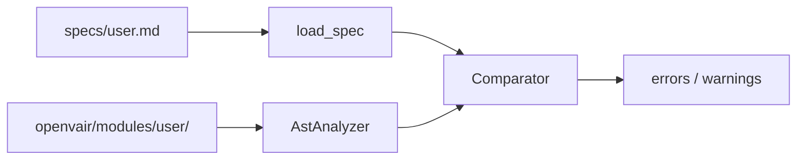

# Руководство по линтеру архитектурных контрактов RDE

Полное описание пакета `requirements_linter` в репозитории Open vAIR. Документ рассчитан на разработчика, который **впервые** сталкивается с инструментом: от общей идеи до команд, сообщений об ошибках и ограничений.

Англоязычная версия: [LINTER_GUIDE_EN.md](LINTER_GUIDE_EN.md).

---

## Содержание

1. [Зачем нужен этот инструмент](#1-зачем-нужен-этот-инструмент)
2. [Что линтер делает и чего не делает](#2-что-линтер-делает-и-чего-не-делает)
3. [Как устроена проверка (пошагово)](#3-как-устроена-проверка-пошагово)
4. [Файл контракта в каталоге specs](#4-файл-контракта-в-каталоге-specs)
5. [Слои модуля Open vAIR](#5-слои-модуля-open-vair)
6. [Три вида сущностей в контракте](#6-три-вида-сущностей-в-контракте)
7. [Ошибки и предупреждения](#7-ошибки-и-предупреждения)
8. [Служебные ключи в данных линтера](#8-служебные-ключи-в-данных-линтера)
9. [HTTP-маршруты FastAPI](#9-http-маршруты-fastapi)
10. [Запуск из командной строки](#10-запуск-из-командной-строки)
11. [Интеграция с pre-commit](#11-интеграция-с-pre-commit)
12. [Структура пакета requirements_linter](#12-структура-пакета-requirements_linter)
13. [Сообщения линтера: что означают и как исправить](#13-сообщения-линтера-что-означают-и-как-исправить)
14. [Ограничения при разборе HTTP](#14-ограничения-при-разборе-http)
15. [Рабочий процесс для нового и существующего модуля](#15-рабочий-процесс-для-нового-и-существующего-модуля)
16. [Частые вопросы](#16-частые-вопросы)
17. [Справочник команд](#17-справочник-команд)

---

## 1. Зачем нужен этот инструмент

Open vAIR строится по **предметно-ориентированному проектированию** (DDD): код каждой функциональности лежит в `openvair/modules/<имя>/` и внутри делится на слои — `domain`, `service_layer`, `adapters`, `entrypoints`. Параллельно для модуля ведётся **архитектурный контракт** — формальное описание того, какие классы, функции и HTTP-точки входа считаются **согласованным публичным интерфейсом** модуля.

Без автоматической проверки контракт и код со временем **расходятся**:

- в спецификации остаётся старый метод, в коде он переименован;
- добавили новый REST-эндпоинт, но не обновили `specs/<модуль>.md`;
- в контракте указан класс в слое `domain`, а файл лежит в другом каталоге.

Линтер RDE (**Requirements-Driven Engineering**, разработка, опирающаяся на требования) решает эту задачу: он **читает контракт** и **читает исходники Python**, затем **сравнивает** их. Результат — список конкретных несоответствий, пригодный для CI и для локальной проверки перед коммитом.

Инструмент **не заменяет** юнит-тесты и **не проверяет** правильность бизнес-логики. Он отвечает на вопрос: «То, что мы **обещали** в архитектурном контракте, **есть** в коде в ожидаемом виде?»

---

## 2. Что линтер делает и чего не делает

### 2.1. Что делает


| Действие                          | Пояснение                                               |
| --------------------------------- | ------------------------------------------------------- |
| Читает `specs/<имя>.md`           | Из Markdown извлекается блок ````rde` с YAML-контрактом |
| Обходит `openvair/modules/<имя>/` | Все файлы `*.py`, кроме `tests/` и `__pycache__`        |
| Разбирает код через AST           | Строится дерево синтаксиса; код **не выполняется**      |
| Сверяет контракт с кодом          | Классы, методы, функции уровня модуля, маршруты FastAPI |


Проверяются только **открытые** имена: не начинающиеся с `_`. Внутренние вспомогательные функции и методы в контракт не входят.

---

## 3. Как устроена проверка (пошагово)

Ниже — логическая цепочка одного прогона для пары «файл контракта + каталог модуля».




**Шаг 1. Загрузка контракта** (`contract/spec_document.py`)

- Открывается файл `specs/<имя>.md`.
- Из текста вырезается первый блок с меткой `rde` (ограждённый ````rde` … `````).
- YAML разбирается и приводится к единому виду: поля `feature`, `layers`, списки `required_classes`, `required_module_functions`, `required_http_endpoints`.

**Шаг 2. Чтение кода модуля** (`core/ast_specs.py`, `core/analyzer.py`)

- Рекурсивно читаются все `*.py` под `openvair/modules/<имя>/`.
- Для каждого файла по **первому сегменту пути** определяется слой (например, `entrypoints/api.py` → слой `entrypoints`).
- Из AST собирается **индекс по слоям**:
  - для каждого класса — список публичных методов;
  - под специальным ключом `$module_functions$` — для каждого файла список функций верхнего уровня;
  - в слое `entrypoints` под ключом `$http_endpoints$` — список HTTP-маршрутов.

**Шаг 3. Сравнение** (`core/comparator.py`)

- Для каждого слоя, описанного в контракте, проверяется: всё ли **заявленное в YAML** **найдено в коде**.
- При включённых предупреждениях дополнительно сообщается: что **есть в коде**, но **не перечислено** в контракте.

**Шаг 4. Результат**

- **Ошибки** — нарушение «контракт требует → в коде нет»; процесс завершается с кодом `1`.
- **Предупреждения** — «в коде есть → в контракте не описано»; код выхода остаётся `0`, если ошибок нет.

Один и тот же вход всегда даёт один и тот же результат: используется только синтаксический разбор, без случайности и без обращения к нейросетям.

---

## 4. Файл контракта в каталоге specs

### 4.1. Где лежит и как называется

- Каталог: `specs/` в корне репозитория.
- Имя файла: обычно совпадает с именем модуля, например `user.md`, `scheduler.md`.
- Поле `feature:` в YAML должно совпадать с именем каталога модуля: `openvair/modules/user/`.

### 4.2. Две части файла

**Часть для человека** — заголовки, описание модуля, диаграммы (как в `specs/scheduler.md`). Линтер эту часть **не анализирует**.

**Машиночитаемая часть** — блок:

```markdown
# Контракт Open vAIR: my_feature

Краткое описание (произвольный текст).

```rde
meta:
  source: openvair/modules/my_feature
feature: my_feature
layers:
  domain:
    required_classes: []
  service_layer:
    required_classes: []
  adapters:
    required_classes: []
  entrypoints:
    required_classes: []
```

```

Метка `rde` в начале блока кода **обязательна**. Без неё `load_spec` завершится ошибкой.

### 4.3. Устаревший формат

Поддерживаются отдельные файлы `specs/<имя>.yaml` / `.yml` без Markdown. Для новых модулей принят формат `.md` с блоком `rde`.

### 4.4. Сокращённая запись в YAML

Вместо длинных списков можно использовать сокращения; при загрузке они превращаются в канонический вид:


| Сокращение                              | Становится                   |
| --------------------------------------- | ---------------------------- |
| `classes:`                              | `required_classes:`          |
| `module_functions:`                     | `required_module_functions:` |
| `http:` с `router_prefix` и `endpoints` | `required_http_endpoints:`   |


---

## 5. Слои модуля Open vAIR

Линтер понимает только четыре имени первого уровня в пути файла внутри модуля:


| Слой            | Каталог          | Типичное содержимое                  |
| --------------- | ---------------- | ------------------------------------ |
| `domain`        | `domain/`        | Сущности, доменные сервисы, правила  |
| `service_layer` | `service_layer/` | Сценарии использования, Unit of Work |
| `adapters`      | `adapters/`      | Репозитории, ORM, внешние адаптеры   |
| `entrypoints`   | `entrypoints/`   | FastAPI, CRUD, схемы запросов        |


Если файл лежит вне этих путей (например, `helpers/foo.py` на верхнем уровне модуля), он **не попадёт** ни в один слой и не участвует в сверке по слоям.

В контракте в секции `layers:` указывают только те слои, которые нужно проверять. Пустой слой (`required_classes: []`) допустим.

---

## 6. Три вида сущностей в контракте

### 6.1. Классы и методы (`required_classes`)

В контракте:

```yaml
domain:
  required_classes:
    - name: CronJobScheduler
      methods:
        - create_job
        - delete_job
```

Линтер ищет в файлах слоя `domain/` класс с **точным** именем `CronJobScheduler` и проверяет, что у него есть **публичные** методы `create_job` и `delete_job`.

Важно:

- `SchedulerCRUD` и `SchedulerCrud` — **разные** имена.
- Приватный метод `_internal` в контракт не включают и линтер его не требует.

### 6.2. Функции уровня модуля (`required_module_functions`)

Для функций, объявленных **на верхнем уровне файла** (не внутри класса):

```yaml
entrypoints:
  required_module_functions:
    - relative_path: entrypoints/api.py
      functions:
        - get_jobs
        - create_job
```

- `relative_path` — путь **от корня** `openvair/modules/<feature>/`, не от корня репозитория.
- Файл должен существовать и попадать в известный слой (`entrypoints/...`).

### 6.3. HTTP-маршруты (`required_http_endpoints`)

Только для слоя `entrypoints`. Каждая запись — один маршрут:

```yaml
entrypoints:
  required_http_endpoints:
    - method: GET
      path: /scheduler/jobs
      handler: get_jobs
      parameters:
        - name: crud
          kind: depends
          required: true
          type_hint: SchedulerCRUD
```

Совпадение проверяется по **тройке**: HTTP-метод (GET, POST, …), **полный** путь (с учётом префикса `APIRouter`), имя **функции-обработчика**.

Параметры обработчика сравниваются по наборам полей: `name`, `kind`, `required`, `type_hint`.

---

## 7. Ошибки и предупреждения

### 7.1. Ошибки (блокируют коммит / CI)

**Направление проверки: контракт → код.**

Пример: в контракте указан метод `update_job`, в классе есть только `edit_job`. Линтер выдаст ошибку вида «Class X does not contain expected method update_job».

Пока есть хотя бы одна ошибка, команда завершается с кодом `1`.

### 7.2. Предупреждения (не блокируют по умолчанию)

**Направление: код → контракт.**

Пример: в коде у класса есть публичный метод `helper_method`, в контракте он не перечислен. Линтер напечатает предупреждение; CI при этом может пройти.

Отключить предупреждения:

```bash
python requirements_linter/rde_linter.py specs/user.md openvair/modules/user --no-warn-extras
python requirements_linter/lint_repo_specs.py --no-warn-extras
```

Имеет смысл **сначала** устранить все ошибки, **затем** решать, нужно ли расширять контракт из-за предупреждений.

---

## 8. Служебные ключи в данных линтера

Внутри программы для каждого слоя строится один словарь. В нём хранятся:

- обычные ключи — **имена классов** → списки методов;
- `**$module_functions$`** — вложенный словарь «путь файла → имена функций верхнего уровня»;
- `**$http_endpoints$`** — список маршрутов (только entrypoints).

Это **не имена классов в вашем проекте**. Если в Python случайно назвать класс `$module_functions$`, линтер прервёт разбор с ошибкой: имя конфликтует со служебным ключом.

В YAML-контракте эти строки тоже **нельзя** использовать как `name` в `required_classes`.

---

## 9. HTTP-маршруты FastAPI

### 9.1. Как линтер находит путь

1. В файле ищутся присваивания вида `router = APIRouter(prefix="/scheduler")` (префикс — **строковый литерал**).
2. Ищутся декораторы `@router.get("/jobs")`, `@router.post(...)`, и т.д. (путь — **строковый литерал**).
3. Префикс и путь объединяются в один строковый путь для контракта.

### 9.2. Поле `kind` у параметра


| В коде обработчика                                                    | Значение `kind` в контракте                     |
| --------------------------------------------------------------------- | ----------------------------------------------- |
| `Depends(...)`                                                        | `depends`                                       |
| `Path(...)`                                                           | `path`                                          |
| `Query(...)`                                                          | `query`                                         |
| `Body(...)`, `Form(...)`, `File(...)`                                 | `body`                                          |
| Нет явного FastAPI-дефолта, аннотация вида `schemas.CreateJobRequest` | часто `body` (правило по форме аннотации в AST) |
| Иначе                                                                 | обычно `query`                                  |


Если линтер и контракт расходятся по `kind` или `type_hint`, появится сообщение `parameter contract mismatch` с двумя списками: что в spec и что извлечено из кода.

**Надёжный способ:** явно указать в контракте `kind` и `type_hint` так, как их выводит линтер после одного успешного прогона, либо использовать в коде явные `Body()` / `Query()` / `Depends()`.

---

## 10. Запуск из командной строки

Все команды выполняют из **корня клона** Open vAIR (где лежат каталоги `specs/` и `openvair/`). Нужен Python из виртуального окружения проекта (`./venv/bin/python`).

### 10.1. Один модуль (основной режим при разработке)

```bash
python requirements_linter/rde_linter.py specs/user.md openvair/modules/user
```

Первый аргумент — файл контракта, второй — каталог модуля.

**Учебный прогон без файлов на диске:**

```bash
python requirements_linter/rde_linter.py --demo
```

**Важно:** если запустить без аргументов:

```bash
python requirements_linter/rde_linter.py
```

проверяются только `specs/storage.md` и `openvair/modules/storage/` (значения по умолчанию). Для `scheduler`, `user` и других модулей пути нужно указывать **явно**.

### 10.2. Все модули в specs/

```bash
python requirements_linter/lint_repo_specs.py
```

Для каждого `specs/*.md`:

- читается `feature` из контракта → модуль `openvair/modules/<feature>/`;
- если `feature` нет — берётся имя файла без расширения (`backup.md` → `backup`).

Если каталога модуля нет, будет сообщение `bounded context directory missing`.

### 10.3. Коды завершения


| Код | Значение                                                 |
| --- | -------------------------------------------------------- |
| `0` | Нет ошибок «контракт → код» (предупреждения допускаются) |
| `1` | Есть хотя бы одна такая ошибка                           |


---

## 11. Интеграция с pre-commit

В `.pre-commit-config.yaml` подключён хук `rde-spec-linter`. Он запускает тот же сценарий, что и `lint_repo_specs.py`, через скрипт `.githooks/rde-linter`.

Установка (один раз в клоне):

```bash
./venv/bin/pre-commit install
```

Ручной прогон:

```bash
./venv/bin/pre-commit run rde-spec-linter --all-files
```

Хук срабатывает при коммите, если изменялись файлы в `specs/` (см. настройку `files: ^specs/` в конфиге).

---

## 12. Структура пакета requirements_linter

```
requirements_linter/
  _paths.py              # корень репозитория; добавление в sys.path
  rde_linter.py          # обёртка: один модуль (удобный путь для CLI)
  lint_repo_specs.py     # обёртка: все specs/ (pre-commit)

  entrypoints/           # командная строка
    cli.py               # аргументы, run_on_openvair_module, main
    rde_linter.py        # точка входа одного модуля
    lint_repo_specs.py   # обход всех specs/*.md

  contract/
    spec_document.py     # блок rde, load_spec, нормализация YAML

  core/
    ast_specs.py         # чтение .py, индекс по слоям, build_code_artifacts
    analyzer.py          # обёртка: каталог модуля → индекс
    comparator.py        # сравнение контракта с индексом

  http/
    http_routes.py       # разбор FastAPI-маршрутов из AST
    naming.py            # правило «публичное имя»

  tests/                 # юнит-тесты линтера
  LINTER_GUIDE_RU.md
  LINTER_GUIDE_EN.md
```

Кратко по потоку данных:

1. `load_spec` → словарь контракта.
2. `AstAnalyzer.from_bounded_context_dir` → `build_code_artifacts` → индекс по слоям.
3. `Comparator(requirements, code_artifacts).compare()` → ошибки и предупреждения.

---

## 13. Сообщения линтера: что означают и как исправить

### 13.1. Слой и классы


| Сообщение                                         | Что произошло                                                         | Что сделать                                              |
| ------------------------------------------------- | --------------------------------------------------------------------- | -------------------------------------------------------- |
| `Layer 'X' not found under scanned sources`       | В контракте есть слой X, но нет ни одного `.py` в каталоге этого слоя | Добавить файлы в слой или убрать слой из контракта       |
| `class Foo not found in code artifacts`           | Класс указан в контракте, в слое не найден                            | Проверить имя и слой; класс может быть в другом каталоге |
| `does not contain expected method bar`            | Метод в контракте, в классе нет публичного `bar`                      | Переименовать в коде или обновить контракт               |
| `uses disallowed class name '$module_functions$'` | В YAML указано зарезервированное имя                                  | Переименовать класс в контракте                          |


### 13.2. Функции файла


| Сообщение                                          | Что сделать                                                    |
| -------------------------------------------------- | -------------------------------------------------------------- |
| `Module file 'entrypoints/api.py' was not scanned` | Проверить путь `relative_path` и что файл в слое `entrypoints` |
| `does not expose expected top-level callable foo`  | Добавить функцию `foo` в файл или убрать из контракта          |


### 13.3. HTTP


| Сообщение                                                     | Что сделать                                                                           |
| ------------------------------------------------------------- | ------------------------------------------------------------------------------------- |
| `No matching HTTP route in code for GET '/path' handler=name` | Сверить method, path (с префиксом router!), имя функции                               |
| `parameter contract mismatch`                                 | Выровнять `parameters` в контракте с выводом линтера (списки spec / code в сообщении) |


### 13.4. Каталог модуля


| Сообщение                           | Что сделать                                                               |
| ----------------------------------- | ------------------------------------------------------------------------- |
| `bounded context directory missing` | Создать `openvair/modules/<feature>/` или исправить `feature` в контракте |


### 13.5. Предупреждения


| Сообщение                                                         | Смысл                                                          |
| ----------------------------------------------------------------- | -------------------------------------------------------------- |
| `Class 'X' is present in code but not listed in required_classes` | Расширить контракт или сделать API внутренним (`_` в имени)    |
| `exposes method 'm' in code but it is not listed in the contract` | Добавить метод в список `methods` или убрать из публичного API |
| `HTTP route ... is present in code but not listed`                | Добавить маршрут в `required_http_endpoints`                   |


---

## 14. Ограничения при разборе HTTP

**Поддерживается:**

- `router = APIRouter(prefix="...")` с константной строкой;
- `@router.get("/path")` / `post` / `put` / `patch` / `delete` с константной строкой;
- обработчик — обычная `def` / `async def` на уровне модуля с публичным именем.

**Не поддерживается (маршрут не попадёт в индекс или путь будет неверным):**

- путь или префикс из переменной;
- обёртки над декоратором маршрута;
- сбор маршрутов через `include_router` без литеральных путей в том же файле;
- генерация маршрутов циклом или метапрограммированием.

В таких случаях либо описывают в контракте только статически видимые маршруты, либо дублируют ожидаемый путь вручную, согласовывая с тем, что реально отдаёт приложение (вне линтера).

---

## 15. Рабочий процесс для нового и существующего модуля

### 15.1. Новый модуль

1. Создать код в `openvair/modules/<feature>/` по слоям DDD.
2. Скопировать шаблон `specs/<другой_модуль>.md`, заменить `feature` и описание.
3. Заполнить блок `rde`: классы, функции, маршруты, которые должны быть **гарантированы** контрактом.
4. Запустить:
  `python requirements_linter/rde_linter.py specs/<feature>.md openvair/modules/<feature>`
5. Исправить все **ошибки**; по **предупреждениям** решить, что входит в публичный контракт.
6. Прогнать `lint_repo_specs.py` и pre-commit перед push.

### 15.2. Изменение существующего модуля

1. Внести изменения в код.
2. Обновить `specs/<feature>.md` (переименования, новые методы, новые эндпоинты).
3. Локально прогнать линтер на **этот** модуль.
4. Перед merge — `lint_repo_specs.py` на весь репозиторий.

### 15.3. Рефакторинг

При массовом переименовании удобный порядок:

1. Обновить контракт под новые имена **или** код под контракт — одно источник истины выбрать осознанно.
2. Прогонять линтер после каждой логической порции изменений.
3. Не отключать предупреждения на постоянной основе без причины — иначе контракт перестаёт отражать реальный API.

---

## 16. Частые вопросы

**Почему линтер «не видит» эндпоинт, хотя в браузере он работает?**  
Частые причины: другой `handler` в декораторе, несовпадение полного пути (забыли префикс `APIRouter`), динамический путь, маршрут подключён через `include_router` из другого файла.

**Нужно ли перечислять все private-методы?**  
Нет. Линтер смотрит только на имена без ведущего `_`.

**Чем отличается `specs/scheduler.md` (большой документ) от блока `rde`?**  
Большой Markdown — документация для людей. Блок ````rde` — то, с чем работает линтер. Они дополняют друг друга.

**Можно ли проверить только изменённые файлы?**  
Штатно — весь модуль или все `specs/*.md`. Точечная проверка: `rde_linter.py` с путями к одному модулю.

---

## 17. Справочник команд

```bash
# Один модуль
python requirements_linter/rde_linter.py specs/user.md openvair/modules/user

# Без предупреждений о лишнем коде
python requirements_linter/rde_linter.py specs/user.md openvair/modules/user --no-warn-extras

# Демо
python requirements_linter/rde_linter.py --demo

# Все контракты в specs/
python requirements_linter/lint_repo_specs.py

# Pre-commit
./venv/bin/pre-commit run rde-spec-linter --all-files

# Тесты самого линтера
./venv/bin/python -m pytest requirements_linter/tests -v --override-ini addopts=
```

---

*Документ соответствует структуре пакета `requirements_linter` в репозитории Open vAIR. При изменении кода линтера сверяйте разделы 3, 8, 12 и 14 с исходниками.*