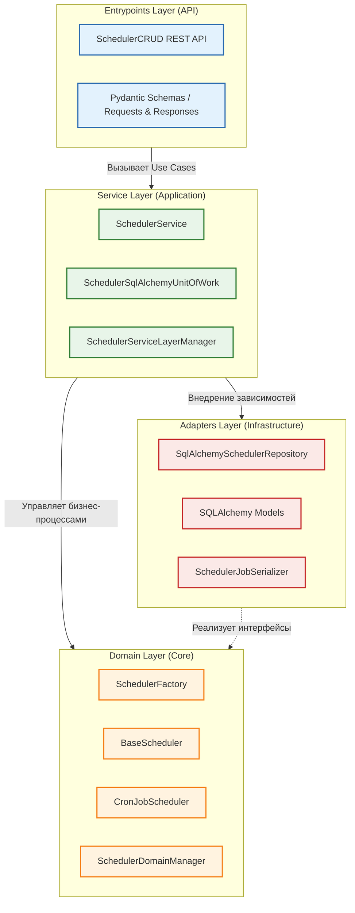

# Спецификация архитектуры модуля: Scheduler (Open vAIR)

**Документ:** Архитектурный контракт и требования к реализации
**Модуль:** `openvair/modules/scheduler`
**Паттерн проектирования:** Domain-Driven Design (DDD), Hexagonal Architecture
**Статус:** Утверждено

## 1. Назначение модуля

Модуль `Scheduler` предназначен для управления отложенными и периодическими задачами (cron-jobs) в рамках платформы виртуализации Open vAIR. Он обеспечивает функционал создания, редактирования, удаления и мониторинга статусов системных задач, изолируя бизнес-логику планировщика от деталей реализации базы данных и внешнего веб-фреймворка.

## 2. Архитектурная модель (DDD)

Архитектура модуля строго разделена на 4 независимых слоя. Направление зависимостей идет снаружи внутрь: от точек входа и адаптеров к сервисному слою, и далее — к ядру предметной области (Domain).




## 3. Требования к слоям и компонентам

### 3.1 Точки входа (Entrypoints)

Слой обеспечивает внешний HTTP-интерфейс (REST API) для взаимодействия с клиентами.

- **Контроллер:** `SchedulerCRUD` должен маршрутизировать вызовы.
- **Эндпоинты:** Поддержка операций CRUD по пути `/scheduler/jobs` (GET, POST, PATCH, DELETE).
- **Контракты данных (DTO):** Обязательное использование схем валидации (например, `CreateJobRequest`, `JobResponse`).

### 3.2 Сервисный слой (Service Layer)

Слой оркестрации (Application Services). Содержит сценарии использования (Use Cases) и управляет транзакциями.

- Должен использовать паттерн Unit of Work (`SchedulerSqlAlchemyUnitOfWork`).
- Основной фасад взаимодействия — `SchedulerService`.

### 3.3 Предметная область (Domain Layer)

Ядро системы, содержащее чистую бизнес-логику, не зависящую от фреймворков.

- **Сущности:** Планировщик абстрагирован через базовый класс `BaseScheduler`. Основная реализация — `CronJobScheduler`.
- **Управление:** `SchedulerDomainManager` отвечает за валидацию cron-выражений и жизненный цикл задач.
- **Фабрики:** Создание объектов делегировано `SchedulerFactory`.

### 3.4 Адаптеры (Adapters)

Слой инфраструктуры, отвечающий за связь с БД и трансформацию данных.

- **Репозиторий:** `SqlAlchemySchedulerRepository` предоставляет методы для взаимодействия с БД (add, get, update, delete).
- **Сериализация:** `SchedulerJobSerializer` обеспечивает трансформацию моделей БД в доменные сущности и обратно.

---

## 4. Машиночитаемый архитектурный контракт (RDE)

Ниже представлен строгий цифровой контракт для RDE-линтера. Любое изменение в коде, нарушающее данный манифест (отсутствие классов, искажение имен методов, смешивание слоев), приведет к блокировке интеграции изменений.

```rde
meta:
  source: openvair/modules/scheduler
feature: scheduler
layers:
  adapters:
    required_classes:
    - name: Base
      methods: []
    - name: SchedulerJob
      methods: []
    - name: SqlAlchemySchedulerRepository
      methods:
      - add
      - get
      - get_all
      - update
      - delete
      - get_by_name
    - name: SchedulerJobSerializer
      methods:
      - to_web
      - to_domain
      - to_db
  domain:
    required_classes:
    - name: BaseScheduler
      methods:
      - create
      - edit
      - delete
    - name: AbstractSchedulerFactory
      methods:
      - get_scheduler
    - name: SchedulerFactory
      methods:
      - get_scheduler
    - name: CronJobScheduler
      methods:
      - create
      - edit
      - delete
    - name: SchedulerDomainException
      methods: []
    - name: CronJobNotFound
      methods: []
    - name: InvalidCronExpression
      methods: []
    - name: SchedulerDomainManager
      methods:
      - create_job
      - edit_job
      - delete_job
  entrypoints:
    required_classes:
    - name: SchedulerCRUD
      methods:
      - get_jobs
      - get_job
      - create_job
      - update_job
      - delete_job
    - name: CreateJobRequest
      methods: []
    - name: UpdateJobRequest
      methods: []
    - name: DeleteJobRequest
      methods: []
    - name: JobResponse
      methods: []
    - name: JobListResponse
      methods: []
    - name: JobStatusResponse
      methods: []
    - name: CreateJobResponse
      methods: []
    - name: ErrorResponse
      methods: []
    - name: DeleteResponse
      methods: []
    required_module_functions:
    - relative_path: entrypoints/api.py
      functions:
      - get_jobs
      - get_job
      - create_job
      - update_job
      - delete_job
    required_http_endpoints:
    - method: GET
      path: /scheduler/jobs
      handler: get_jobs
      parameters:
      - name: crud
        kind: depends
        required: true
        type_hint: SchedulerCRUD
      - name: params
        kind: depends
        required: true
        type_hint: Params
    - method: GET
      path: /scheduler/jobs/{job_id}
      handler: get_job
      parameters:
      - name: crud
        kind: depends
        required: true
        type_hint: SchedulerCRUD
      - name: job_id
        kind: query
        required: true
        type_hint: UUID
    - method: POST
      path: /scheduler/jobs
      handler: create_job
      parameters:
      - name: crud
        kind: depends
        required: true
        type_hint: SchedulerCRUD
      - name: data
        kind: body
        required: true
        type_hint: schemas.CreateJobRequest
    - method: PATCH
      path: /scheduler/jobs/{job_id}
      handler: update_job
      parameters:
      - name: crud
        kind: depends
        required: true
        type_hint: SchedulerCRUD
      - name: data
        kind: body
        required: true
        type_hint: schemas.UpdateJobRequest
      - name: job_id
        kind: query
        required: true
        type_hint: UUID
    - method: DELETE
      path: /scheduler/jobs/{job_id}
      handler: delete_job
      parameters:
      - name: crud
        kind: depends
        required: true
        type_hint: SchedulerCRUD
      - name: job_id
        kind: query
        required: true
        type_hint: UUID
      - name: data
        kind: body
        required: true
        type_hint: schemas.DeleteJobRequest
  service_layer:
    required_classes:
    - name: SchedulerService
      methods:
      - get_all_jobs
      - create_job
      - edit_job
      - delete_job
    - name: SchedulerSqlAlchemyUnitOfWork
      methods: []
    - name: SchedulerServiceLayerManager
      methods:
      - get_all_jobs
      - create_job
      - edit_job
      - delete_job
    - name: SchedulerServiceException
      methods: []
    - name: JobNotFoundError
      methods: []
    - name: JobAlreadyExistsError
      methods: []
    - name: InvalidJobDataError
      methods: []
    - name: JobExecutionError
      methods: []

```

